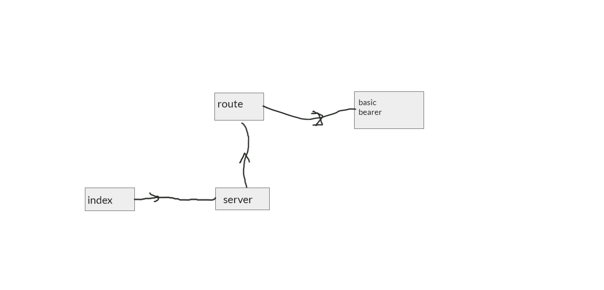

# basic-express-server

[heruko link](https://basic-auth-abu-al3ees.herokuapp.com/)
[action](https://github.com/abu-al3ees/basic-auth/actions)
[repo](https://github.com/abu-al3ees/basic-auth)
[pullreq](https://github.com/abu-al3ees/basic-auth/pull/2)

